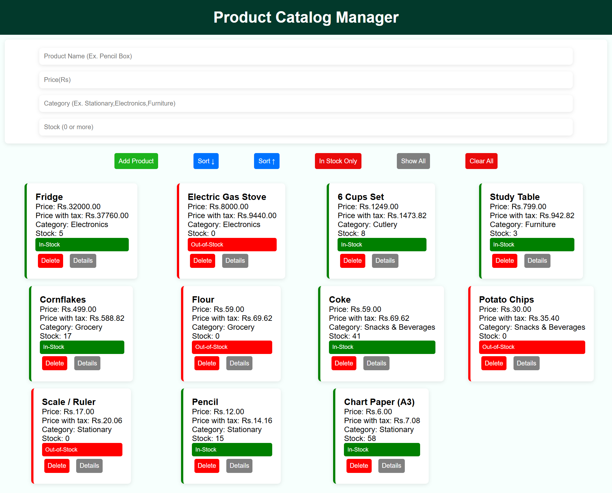

#Product Catalog Manager

A responsive web application to manage and organize product data dynamically.

> Developed as part of a Web Programming lab assignment, with significant enhancements including UI redesign and improved user interactions.

---

## Overview

This project demonstrates practical usage of JavaScript for managing structured data using objects and arrays.
It focuses on building a scalable UI with reusable components, validation, and interactive filtering/sorting features.

---

## Features

* Form Fields: Product Name, Price, Category, Stock

* Buttons:

  * Add Product
  * Sort by Price (Ascending / Descending)
  * Filter (In-Stock Only)
  * Show All Products
  * Clear All Data (with confirmation)

* Validation:

  * Input validation with error messages
  * Ensures valid price and stock values

* Dynamic Product Cards:

  * Displays product details in card format
  * Shows price with tax calculation
  * Indicates stock status (In Stock / Out of Stock)
  * Delete individual products
  * View complete product details

* Smart UI Behavior:

  * Conditional styling based on stock availability
  * Clean and responsive grid layout

---

## Tech Stack

* HTML5
* CSS3
* JavaScript (Vanilla JS)

---

## Usage

1. Enter product details (Name, Price, Category, Stock)
2. Click **Add Product** to insert into the catalog
3. Use sorting and filtering buttons to manage products
4. Click **Details** to view all product properties
5. Use **Clear All** to reset the catalog

---

## Learning Outcome

By developing this project, I learned:

* How to design **objects with both data and methods**

* How to encapsulate logic using object methods like:

  * `getPriceWithTax()`
  * `isAvailable()`
  * `toHTML()`

* How to use **Object.entries()** to iterate over object properties

* How to use **unique IDs (`Date.now()`)** for managing data reliably

* How to use modern array methods:

  * `map()`, `filter()`, `find()`, `findIndex()`, `sort()`

* How to build a **component-like structure in Vanilla JavaScript**

* Improved understanding of **code organization and reusability**

> This project reflects a step forward in structuring JavaScript applications with better abstraction and cleaner design patterns.

---

## 📸 Preview

